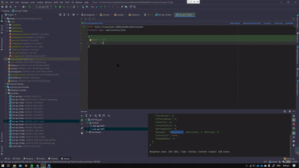
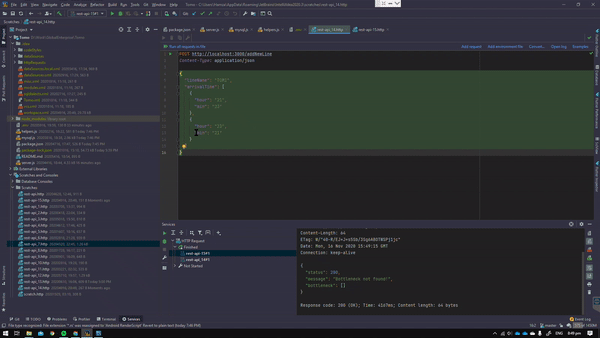
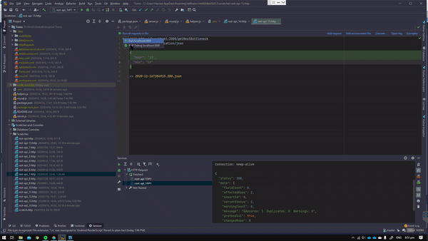
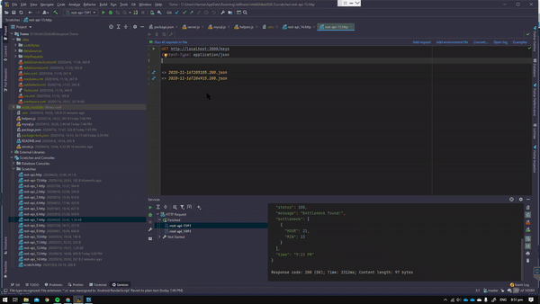

# Trains: Backend

This is a web server based i  n NodeJS

## Installation

```bash
git clone https://github.com/kinshark/trains2mo .
npm install
```

## Create Database Table

```sql
CREATE TABLE `TOMO` (
  `LINE_NAME` varchar(4) NOT NULL,
  `HOUR` int(2) NOT NULL,
  `MIN` int(2) NOT NULL,
  PRIMARY KEY (`LINE_NAME`,`HOUR`,`MIN`)
) ENGINE=InnoDB DEFAULT CHARSET=latin1;

```
## Process
Create .env file with these contents from your MySQL server:
```bash
HOST=db_hostname
USER=db_user
PASSWORD=db_password
DATABASE=db_name
PORT=db_port
SERVER_PORT=server_port
```

## Run the app
```bash 
node server.js
```
or
```bash 
nodemon server.js
```

## API Tests


No bottlenecks



Adding new data (same minutes)



Checking bottlenecks again



Keys API


## Contributing
Pull requests are welcome. For major changes, please open an issue first to discuss what you would like to change.

Please make sure to update tests as appropriate.

